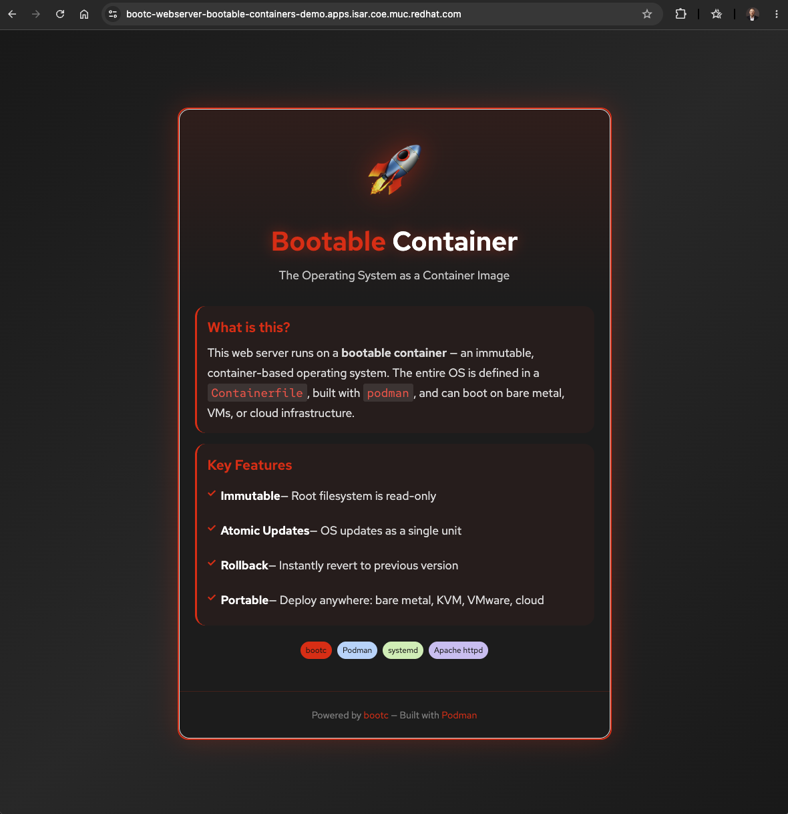
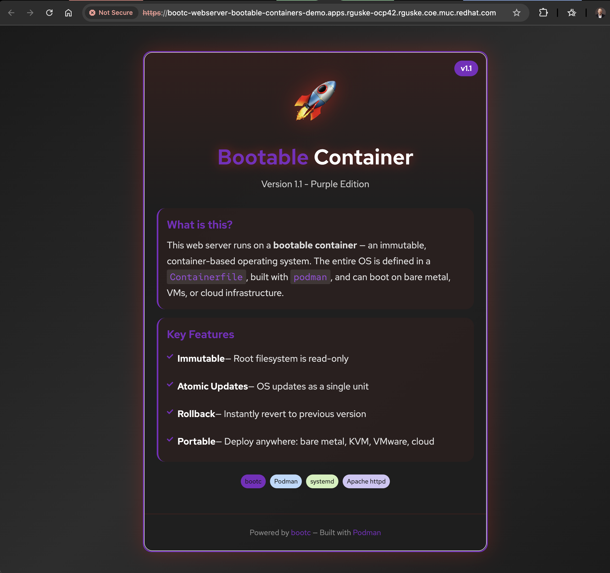

# Bootable Containers (Image Mode)

A learning guide for understanding, building, and deploying Bootable Containers in the context of Red Hat OpenShift and OpenShift Virtualization.

> **Note**: This project uses **CentOS Stream 9** bootc images for simplicity (no subscription required). The concepts apply equally to RHEL bootc images.

> **CI/CD**: For building, converting, and deploying these images automatically via GitHub Actions, OpenShift Pipelines, or GitOps, see the [CI/CD README](cicd/README.md).

## Table of Contents

- [Concepts](#concepts)
- [Key Components](#key-components)
- [Architecture](#architecture)
- [Prerequisites](#prerequisites)
- [Demo 1: Build a Web Server](#demo-1-build-a-web-server)
- [Demo 2: Regular Container vs Bootable Container](#demo-2-regular-container-vs-bootable-container)
- [Demo 3: Deploy to OpenShift Virtualization](#demo-3-deploy-to-openshift-virtualization)
- [Demo 4: Upgrade and Rollback](#demo-4-upgrade-and-rollback)
- [CI/CD Integration](#cicd-integration)
- [Updates and Rollbacks](#updates-and-rollbacks)
- [Best Practices](#best-practices)
- [References](#references)

---

## Concepts

### What are Bootable Containers?

**Bootable Containers** (also known as **Image Mode**) represent a paradigm shift in how operating systems are built, deployed, and managed. Instead of treating the OS as a collection of packages installed and configured imperatively, bootable containers treat the **entire operating system as a container image**.

```
┌─────────────────────────────────────────────────────────────────┐
│                Traditional (Package Mode)                        │
│  ┌─────────────────────────────────────────────────────────────┐│
│  │  Install OS → Install Packages → Configure → Deploy         ││
│  │         (Mutable, Imperative, Drift-prone)                  ││
│  └─────────────────────────────────────────────────────────────┘│
└─────────────────────────────────────────────────────────────────┘

┌─────────────────────────────────────────────────────────────────┐
│                  Image Mode (bootc)                              │
│  ┌─────────────────────────────────────────────────────────────┐│
│  │  Containerfile → Build Image → Push → Deploy/Boot           ││
│  │      (Immutable, Declarative, Reproducible)                 ││
│  └─────────────────────────────────────────────────────────────┘│
└─────────────────────────────────────────────────────────────────┘
```

### Package Mode vs Image Mode


| Aspect              | Package Mode              | Image Mode                        |
| ------------------- | ------------------------- | --------------------------------- |
| **Delivery**        | RPM packages via `dnf`    | Container images                  |
| **Updates**         | Package-by-package        | Atomic image replacement          |
| **Rollback**        | Complex, often impossible | Simple, automatic                 |
| **Root Filesystem** | Mutable                   | Immutable (except `/etc`, `/var`) |
| **Configuration**   | Runtime, imperative       | Build time, declarative           |
| **Consistency**     | Drift over time           | Guaranteed identical              |
| **Testing**         | Test each package combo   | Test entire image                 |


### Why Bootable Containers?

1. **Unified Workflow**: Same tools (Podman, Containerfile, registries) for apps AND operating systems
2. **Immutability**: Root filesystem is read-only, preventing configuration drift
3. **Atomic Updates**: Update the entire OS as one unit, not package by package
4. **Easy Rollbacks**: Boot into previous image version if issues arise
5. **GitOps Ready**: OS configuration can be versioned and managed via Git
6. **Container-Native**: Seamless integration with OpenShift and Kubernetes workflows

---

## Key Components

### `bootc`

The core tool that manages bootable container images on a system:

```bash
# Check current booted image
bootc status

# Switch to a new image
bootc switch quay.io/myorg/my-bootc:latest

# Update to latest version of current image
bootc upgrade

# Rollback to previous image
bootc rollback
```

### `bootc-image-builder`

A containerized tool that converts bootc container images into various disk formats:


| Output Type | Use Case                               |
| ----------- | -------------------------------------- |
| `qcow2`     | KVM, OpenShift Virtualization, libvirt |
| `vmdk`      | VMware vSphere                         |
| `raw`       | Bare metal, direct disk write          |
| `iso`       | Installation media                     |
| `ami`       | AWS EC2                                |


### Base Images

This project uses CentOS Stream 9 bootc:

```bash
# CentOS Stream 9 (used in this project)
quay.io/centos-bootc/centos-bootc:stream9

# Fedora (alternative)
quay.io/fedora/fedora-bootc:41

# RHEL (requires subscription)
registry.redhat.io/rhel9/rhel-bootc:9.6
```

---

## Architecture

```
┌─────────────────────────────────────────────────────────────────────┐
│                        Build Pipeline                                │
│  ┌──────────────┐    ┌──────────────┐    ┌──────────────────────┐  │
│  │ Containerfile │───▶│ podman build │───▶│ Container Registry   │  │
│  │ (OS Config)   │    │              │    │ (quay.io, etc.)      │  │
│  └──────────────┘    └──────────────┘    └──────────────────────┘  │
└─────────────────────────────────────────────────────────────────────┘
                                                      │
                    ┌─────────────────────────────────┼─────────────────┐
                    │                                 │                 │
                    ▼                                 ▼                 ▼
┌─────────────────────────┐  ┌─────────────────────────┐  ┌─────────────────────┐
│    Direct Boot (bootc)   │  │   bootc-image-builder   │  │  OpenShift Deploy   │
│                          │  │                         │  │                     │
│  • Bare metal            │  │  • QCOW2 → KVM/OCP-V    │  │  • DataVolume       │
│  • Existing system       │  │  • VMDK → VMware        │  │  • VirtualMachine   │
│  • bootc switch/upgrade  │  │  • ISO → Installation   │  │  • Auto-import      │
└─────────────────────────┘  └─────────────────────────┘  └─────────────────────┘
```

---

## Prerequisites

### Set Environment Variable

All commands in this guide use the `${USERNAME}` environment variable. Set it once:

```bash
export USERNAME=<your-quay-username>
```

### Local Development Machine

```bash
# Required: Podman 4.0+
podman --version

# Login to quay.io (or your registry)
podman login quay.io
```

> **macOS Users**: Building bootc container images works on macOS. However, converting to QCOW2 with `bootc-image-builder` requires a **Linux x86_64 system** (local VM or remote server). See Demo 3 for details.

### OpenShift Cluster (for OCP-V demos)

- OpenShift 4.14+ with OpenShift Virtualization operator
- Access to create DataVolumes and VirtualMachines

---

## Demo 1: Build a Web Server

Build a simple Apache httpd web server as a bootable container.

### Build and Push

```bash
cd demos/webserver

# Remove existing image/manifest if present
podman manifest rm quay.io/${USERNAME}/bootc-webserver:v1.0 2>/dev/null || true

# Create manifest and build for both architectures
podman manifest create quay.io/${USERNAME}/bootc-webserver:v1.0
podman build --platform linux/amd64,linux/arm64 \
  --manifest quay.io/${USERNAME}/bootc-webserver:v1.0 .

# Push the manifest
podman manifest push --all quay.io/${USERNAME}/bootc-webserver:v1.0
```

### Test Locally (Quick Check)

Bootable containers use systemd and are designed to boot as VMs. For a quick local test, run httpd directly:

```bash
# Run httpd directly (bypasses systemd)
podman run -d --name webserver-test -p 8080:80 \
  quay.io/${USERNAME}/bootc-webserver:v1.0 \
  /usr/sbin/httpd -DFOREGROUND

# Test
curl http://localhost:8080

# Cleanup
podman rm -f webserver-test
```

> **Note**: This only tests the web content. For a full test with systemd services, deploy as a VM (see Demo 3).

---

## Demo 2: Regular Container vs Bootable Container

Now that you've built a bootable container, compare it with a regular container to see the differences.

### Quick Comparison


| Aspect             | Regular Container        | Bootable Container          |
| ------------------ | ------------------------ | --------------------------- |
| **Purpose**        | Run a single application | Run a full operating system |
| **Init (PID 1)**   | Application process      | systemd                     |
| **Kernel**         | Uses host kernel         | Contains its own kernel     |
| **Size**           | ~100 MB                  | ~1.5 GB                     |
| **Can boot as VM** | No                       | Yes                         |
| **Atomic updates** | No                       | Yes (via `bootc`)           |


### Run the Comparison Demo

```bash
cd demos/comparison
./compare.sh
```

This script compares:

- Image sizes
- Kernel presence (`/boot/vmlinuz*`)
- Init system (`/sbin/init`)
- Kernel modules (`/usr/lib/modules/`)
- systemd services
- bootc tool availability

See `demos/comparison/README.md` for individual commands to run step-by-step.

---

## Demo 3: Deploy to OpenShift Virtualization

Convert the bootable container to a QCOW2 disk image and deploy it as a VM.

### Step 1: Build and Push (macOS or Linux)

Build the bootc container image and push to your registry. This works on any platform:

```bash
cd demos/webserver

# Remove existing manifest if present
podman manifest rm quay.io/${USERNAME}/bootc-webserver:v1.0 2>/dev/null || true

# Create manifest and build for both architectures
podman manifest create quay.io/${USERNAME}/bootc-webserver:v1.0
podman build --platform linux/amd64,linux/arm64 \
  --manifest quay.io/${USERNAME}/bootc-webserver:v1.0 .

# Push the manifest (includes both architectures)
podman manifest push --all quay.io/${USERNAME}/bootc-webserver:v1.0
```

> **Note**: Multi-arch builds create a manifest list that works on both x86_64 and ARM64 systems. On Apple Silicon, amd64 builds use emulation (slower but works).

### Step 2: Convert to QCOW2 (Linux x86_64 Required)

> **Important**: `bootc-image-builder` requires access to host container storage via `-v /var/lib/containers/storage:/var/lib/containers/storage`. This **only works on native Linux** - it cannot run reliably on macOS due to Podman Machine virtualization limitations.

**Required packages on the Linux system:**

```bash
# Fedora/CentOS/RHEL
sudo dnf install -y podman osbuild-selinux

# Ubuntu/Debian
sudo apt install -y podman
```


| Package           | Purpose                                                        |
| ----------------- | -------------------------------------------------------------- |
| `podman`          | Container runtime (4.0+ required)                              |
| `osbuild-selinux` | SELinux policies for osbuild (required if SELinux is enforced) |


Run this on a **Linux x86_64 system** (local VM or remote server):

```bash
# Login to registry first
podman login quay.io

export USERNAME=<your-quay-username>

# Pull the bootc image first (bootc-image-builder no longer pulls automatically)
sudo podman pull quay.io/${USERNAME}/bootc-webserver:v1.0

mkdir -p output

sudo podman run \
  --rm -it --privileged \
  --pull=newer \
  --security-opt label=type:unconfined_t \
  -v "$PWD/output":/output \
  -v /var/lib/containers/storage:/var/lib/containers/storage \
  quay.io/centos-bootc/bootc-image-builder:latest \
  --type qcow2 \
  quay.io/${USERNAME}/bootc-webserver:v1.0

# Result: output/qcow2/disk.qcow2
```

Example terminal output:

```code
[rguske@centos-image-builder ~]$ sudo podman run \
  --rm -it --privileged \
  --pull=newer \
  --security-opt label=type:unconfined_t \
  -v "$PWD/output":/output \
  -v /var/lib/containers/storage:/var/lib/containers/storage \
  quay.io/centos-bootc/bootc-image-builder:latest \
  --type qcow2 \
  quay.io/${USERNAME}/bootc-webserver:v1.0
[-] Disk image building step
[5 / 5] Pipeline qcow2 [--------------------------------------------------------------------------------------------------------->] 100.00%
[2 / 2] Stage org.osbuild.qemu [------------------------------------------------------------------------------------------------->] 100.00%
Message: Results saved in .
[rguske@centos-image-builder ~]$
```

**Options for Linux x86_64 environment:**


| Option                  | Description                                                       |
| ----------------------- | ----------------------------------------------------------------- |
| **Local Linux VM**      | Run Fedora/CentOS in UTM, VMware Fusion, or Parallels on your Mac |
| **Remote Linux server** | SSH to any Linux x86_64 server and run the command there          |
| **GitHub Actions**      | Use the workflow in `cicd/github-actions/` for automated builds   |


See [bootc-image-builder README](https://github.com/osbuild/bootc-image-builder) for more details.

### Step 3: Package QCOW2 for OCP-V

After converting to QCOW2 on Linux, you have two options:

**Option A: Package on the Linux host (recommended)**

Create the `Containerfile.ocpv` on your Linux host:

```bash
cat << 'EOF' > Containerfile.ocpv
FROM registry.access.redhat.com/ubi9/ubi-minimal:latest AS builder
ADD --chown=107:107 output/qcow2/disk.qcow2 /disk/
RUN chmod 0440 /disk/*
FROM scratch
COPY --from=builder /disk/* /disk/
LABEL name="bootc-webserver-disk" version="1.0"
EOF

# Build and push
podman build -f Containerfile.ocpv -t quay.io/${USERNAME}/bootc-webserver:v1.0-disk .
podman push quay.io/${USERNAME}/bootc-webserver:v1.0-disk
```

**Option B: Copy QCOW2 back to macOS**

```bash
# On Linux: copy the QCOW2 to your Mac via scp
scp output/qcow2/disk.qcow2 user@your-mac:/path/to/demos/webserver/output/qcow2/

# On macOS: build and push
cd demos/webserver
podman build -f Containerfile.ocpv -t quay.io/${USERNAME}/bootc-webserver:v1.0-disk .
podman push quay.io/${USERNAME}/bootc-webserver:v1.0-disk
```

> **Important**: Make your Quay.io repository **public**, or create an image pull secret:
>
> ```bash
> # Option 1: Make repository public in Quay.io UI
>
> Go to: quay.io → Repository Settings → Make Public
>
> # Option 2: Create pull secret for private registry
> oc create secret docker-registry quay-pull-secret \
>   --docker-server=quay.io \
>   --docker-username=${USERNAME} \
>   --docker-password=<your-password-or-token> \
>   -n bootable-containers-demo
> ```
>
> If using a pull secret, uncomment `secretRef: quay-pull-secret` in `datavolume.yaml`.

### Step 4: Deploy to OpenShift

```bash
# Go back to project root
cd ../..

# Check available storage classes and set the variable
oc get sc
export STORAGE_CLASS=<your-storage-class>

# Update kustomization.yaml with your values (it ships with rguske /
# kubevirt-odf-replica-two-block as placeholders, see the patches: comment)
sed -i "" "s|rguske|${USERNAME}|g" openshift-virtualization/kustomization.yaml
sed -i "" "s|kubevirt-odf-replica-two-block|${STORAGE_CLASS}|g" openshift-virtualization/kustomization.yaml

# Deploy using kustomize
oc apply -k openshift-virtualization/

# Watch progress
oc get dv -n bootable-containers-demo -w

# Get route URL
oc get route bootc-webserver -n bootable-containers-demo -o jsonpath='{.spec.host}'
```

Once deployed, access the web server via the route URL:



### VM Credentials

The VM has two users configured:

| User | Password | Configured via |
|------|----------|----------------|
| `bootc-user` | `redhat` | Containerfile (always available) |
| `rhel` | `R3dH4t1!` | cloud-init (requires cloud-init in image) |

> **Note**: The `rhel` user is created by cloud-init at first boot. If cloud-init isn't installed in your bootc image, use `bootc-user` instead.

> **Note**: The default VM uses 1 CPU core and 2Gi memory. Adjust `virtualmachine.yaml` if your cluster has different capacity or if you need more resources.

---

## Demo 4: Upgrade and Rollback

Demonstrate bootc's atomic upgrade and rollback capabilities by switching between image versions.

### Prerequisites

- VM running v1.0 from Demo 3
- Both v1.0 and v1.1 images pushed to your registry

### Step 1: Build Both Versions

**v1.0 (red theme, default):**

```bash
cd demos/webserver

# Remove existing manifest if present
podman manifest rm quay.io/${USERNAME}/bootc-webserver:v1.0 2>/dev/null || true

# Create manifest and build multi-arch
podman manifest create quay.io/${USERNAME}/bootc-webserver:v1.0
podman build --platform linux/amd64,linux/arm64 \
  --manifest quay.io/${USERNAME}/bootc-webserver:v1.0 .

podman manifest push --all quay.io/${USERNAME}/bootc-webserver:v1.0
```

**v1.1 (purple theme):**

```bash
# Remove existing manifest if present
podman manifest rm quay.io/${USERNAME}/bootc-webserver:v1.1 2>/dev/null || true

# Create manifest and build multi-arch with theme customization
podman manifest create quay.io/${USERNAME}/bootc-webserver:v1.1
podman build --platform linux/amd64,linux/arm64 \
  --build-arg THEME_COLOR="#7b2cbf" \
  --build-arg THEME_COLOR_DARK="#5a189a" \
  --build-arg THEME_COLOR_LIGHT="#9d4edd" \
  --build-arg VERSION="1.1" \
  --build-arg SUBTITLE="Version 1.1 - Purple Edition" \
  --manifest quay.io/${USERNAME}/bootc-webserver:v1.1 .

podman manifest push --all quay.io/${USERNAME}/bootc-webserver:v1.1
```

### Step 2: Verify Current Version

Open the web server URL and confirm you see the **red theme** with **v1.0** badge.

Connect to the VM:

```bash
virtctl console bootc-webserver -n bootable-containers-demo
```

Check current bootc status:

```bash
sudo bootc status
```

```code
[bootc-user@bootc-webserver ~]$ sudo bootc status
[ 1213.908583] SELinux:  Context unconfined_u:object_r:invalid_bootcinstall_testlabel_t:s0 is not valid (left unmapped).
● Booted image: quay.io/rguske/bootc-webserver:v1.0
        Digest: sha256:5d100215e05a702733f7ddbcdca54f0d69e3a4437d3c5396dab368b5ca0c8c51 (amd64)
       Version: 9 (2026-07-31T22:34:55Z)
```

### Step 3: Upgrade to v1.1

```bash
export USERNAME=<your-quay-username>
```

```bash
sudo bootc switch quay.io/${USERNAME}/bootc-webserver:v1.1
```

```code
[bootc-user@bootc-webserver ~]$ sudo bootc switch quay.io/${USERNAME}/bootc-webserver:v1.1
[ 1381.133563] evm: overlay not supported
layers already present: 66; layers needed: 7 (1.1 GB)
Fetched layers: 1.07 GiB in 4 minutes (4.95 MiB/s)


  Deploying: done (15 seconds)                                                  Pruned images: 0 (layers: 0, objsize: 9.4 MB)
Queued for next boot: quay.io/rguske/bootc-webserver:v1.1
  Version: 9
  Digest: sha256:728e8e1d196a4707ab8017948e27e0d73534cee037c4038fd9c05da8a2375a46
```

Reboot to apply:

```bash
sudo systemctl reboot
```

After reboot, refresh the browser. You should see:

- **Purple theme**
- **v1.1** badge
- Subtitle: "Version 1.1 - Purple Edition"



### Step 4: Rollback to v1.0

Connect back into the VM:

```bash
virtctl console bootc-user -n bootable-containers-demo
```

Rollback:

```bash
sudo bootc rollback
sudo systemctl reboot
```

After reboot, refresh the browser. You should see the **red theme** and **v1.0** badge restored.

### Key Takeaways

- **Atomic updates**: The entire OS updates as one unit
- **Instant rollback**: Previous version is preserved and ready to boot
- **No package drift**: Every boot is from a known, tested image

---

## CI/CD Integration

Complete CI/CD pipelines are available in `cicd/`. See `cicd/README.md` for details.

### Options


| Option                  | Best For                |
| ----------------------- | ----------------------- |
| **GitHub Actions**      | GitHub-hosted projects  |
| **OpenShift Pipelines** | OpenShift-native CI/CD  |
| **GitOps (ArgoCD)**     | Declarative deployments |


### Pipeline Flow

```code
Git Push → Build bootc → Convert to QCOW2 → Package → Deploy VM
```

---

## Updates and Rollbacks

### Performing Updates

On a running bootc system:

```bash
bootc status          # Check current image
bootc upgrade         # Pull and stage new image
systemctl reboot      # Apply update
```

### Rollback

```bash
bootc rollback        # Switch to previous image
systemctl reboot      # Apply rollback
```

---

## Best Practices

### 1. Keep Images Small

```dockerfile
RUN dnf install -y httpd vim-minimal && \
    dnf clean all && \
    rm -rf /var/cache/dnf
```

### 2. Version Your Images

```dockerfile
LABEL version="1.2.0"
LABEL description="Web server with Apache httpd"
```

### 3. Test Before Deploy

```bash
podman run --rm -it quay.io/${USERNAME}/bootc-webserver:v1.0 /bin/bash
systemctl list-unit-files --state=enabled
```

### 4. Configuration at Build Time

```dockerfile
COPY httpd.conf /etc/httpd/conf/httpd.conf
COPY app-config.yaml /etc/myapp/config.yaml
```

---

## References

### Official Documentation

- [Image Mode for RHEL - Red Hat Docs](https://docs.redhat.com/en/documentation/red_hat_enterprise_linux/10/html-single/using_image_mode_for_rhel_to_build_deploy_and_manage_operating_systems/index)
- [bootc Project](https://github.com/containers/bootc)
- [bootc-image-builder](https://github.com/osbuild/bootc-image-builder)
- [CentOS bootc Images](https://github.com/CentOS/centos-bootc)

### Red Hat Developer

- [Image Mode Overview](https://developers.redhat.com/products/rhel/image-mode)
- [Deploy to OpenShift Virtualization](https://developers.redhat.com/articles/2024/11/11/deploy-image-mode-rhel-openshift-virtualization)

### Community & Examples

- [rhel-bootc-examples (Red Hat CoP)](https://github.com/redhat-cop/rhel-bootc-examples)
- [bootc-org/examples](https://gitlab.com/bootc-org/examples)
- [Fedora bootc Documentation](https://docs.fedoraproject.org/en-US/bootc/)
