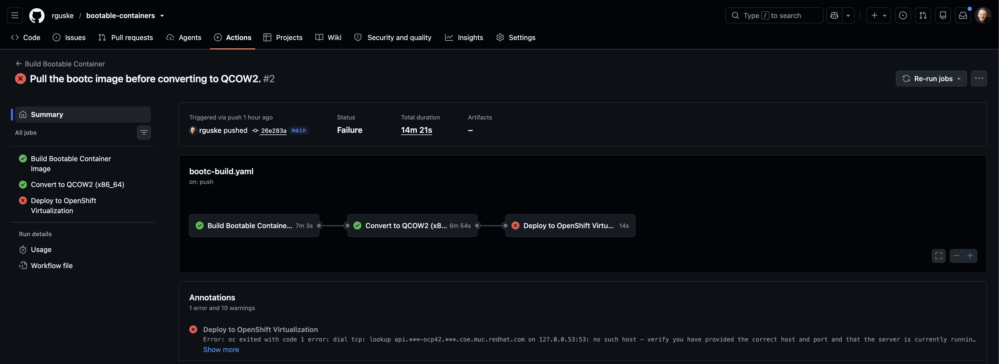
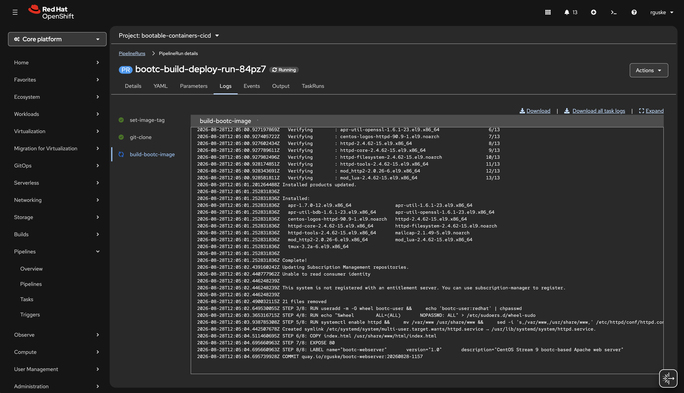
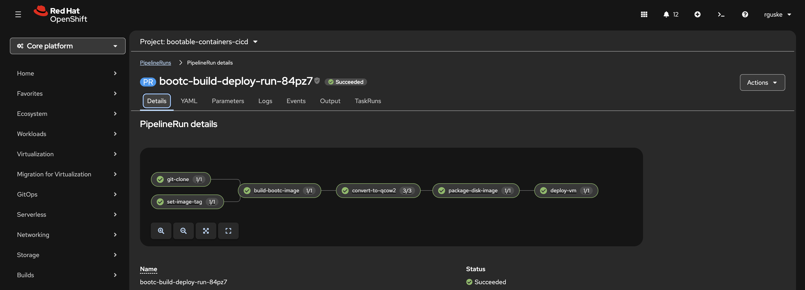

# CI/CD for Bootable Containers

CI/CD for building, converting, and deploying bootable containers to OpenShift Virtualization.

> **Note:** This project uses **CentOS Stream 9** bootc images (no subscription required).

## Overview

```
┌─────────────────────────────────────────────────────────────────────────────────┐
│                           CI/CD Pipeline Flow                                    │
│                                                                                  │
│  ┌──────────┐    ┌──────────┐    ┌──────────┐    ┌──────────┐    ┌──────────┐  │
│  │   Git    │───▶│  Build   │───▶│ Convert  │───▶│ Package  │───▶│  Deploy  │  │
│  │  Push    │    │ Container│    │ to QCOW2 │    │ for OCPV │    │   VM     │  │
│  └──────────┘    └──────────┘    └──────────┘    └──────────┘    └──────────┘  │
│                                                                                  │
│  Triggers:       Podman/        bootc-image-     Container      GitOps/        │
│  - Push          Buildah        builder          with disk      ArgoCD         │
│  - PR                                                                           │
│  - Schedule                                                                     │
└─────────────────────────────────────────────────────────────────────────────────┘
```

## Pipeline Options

### 1. GitHub Actions (`github-actions/`)

Best for GitHub-hosted projects and a small setup. Builds the bootc image, converts to QCOW2, pushes to a registry, and can deploy to OpenShift.

### 2. OpenShift Pipelines / Tekton (`openshift-pipelines/`)

> **Note:** Requires the **OpenShift Pipelines** operator (OperatorHub). Without it, `oc apply` fails with `no matches for kind "Pipeline"`. After install, wait until `tekton-pipelines-webhook` has endpoints.

Best for in-cluster CI/CD, air-gapped environments, and OpenShift-native security.

### 3. GitOps with ArgoCD (`gitops/`)

Best for declarative, Git-driven VM deploys with auto-sync and audit.

## Quick Start

### GitHub Actions

> **Note:** GitHub-hosted runners must reach the OpenShift API on the public internet. If the API is not publicly reachable (typical for lab or private clusters), **deploy** fails at `oc login` even with valid secrets. Build and convert still succeed. Deploy from a network that can reach the cluster, or use OpenShift Pipelines / GitOps inside the cluster.



1. Move the workflow to where GitHub Actions looks for it:

   ```bash
   mkdir -p .github/workflows
   mv cicd/github-actions/bootc-build.yaml .github/workflows/bootc-build.yaml
   ```

2. Add secrets in GitHub (**Settings → Secrets and variables → Actions**). Do not commit them:
   - `REGISTRY_USERNAME`
   - `REGISTRY_PASSWORD` — required to **push**. A public registry only skips **pull** auth.
   - `OPENSHIFT_SERVER` — API URL (`oc whoami --show-server`). Deploy job only.
   - `OPENSHIFT_TOKEN` — API token (`oc whoami --show-token`). Deploy job only.

3. Push to `main`/`develop` (paths: `demos/webserver/**` or the workflow file), open a PR to `main`, or run **Actions → Build Bootable Container**.

**Expected outcome**

- **Actions** shows **Build Bootable Container**.
- Build pushes `$(registry-url)/$(registry-namespace)/$(image-name):$(image-tag)` (UTC `YYYYMMDD-HHMM`, not `latest`).
- On `main` only: convert pushes the same URL with `-disk` on the tag; deploy applies the VM if the API is reachable from GitHub.
- Pull requests run the build job only.

### OpenShift Pipelines

> Requires the **OpenShift Pipelines** operator (OperatorHub). Something not working? See [Troubleshooting](#troubleshooting) — it covers every issue found building this pipeline, in the order you'd hit them.

Image tags use UTC `YYYYMMDD-HHMM`. Leave `image-tag` empty to generate it at run time.

1. Wait for the webhook, then apply the pipeline (not the PipelineRun):

   ```bash
   oc rollout status deploy/tekton-pipelines-webhook -n openshift-pipelines --timeout=300s
   oc apply -k openshift-pipelines/
   ```

   Use `-k`, not `oc apply -f openshift-pipelines/` (`pipelinerun.yaml` uses `generateName` and needs `oc create`).

2. Replace placeholders before you start a run. `YOUR_ORG` and `YOUR_USERNAME` are literal strings in the YAML, not cluster variables.

   | File | Field | Placeholder |
   |------|--------|-------------|
   | `openshift-pipelines/pipelinerun.yaml` | `git-url` | `https://github.com/YOUR_ORG/bootable-containers.git` |
   | `openshift-pipelines/pipelinerun.yaml` | `registry-namespace` | `YOUR_USERNAME` |
   | `openshift-pipelines/pipeline.yaml` | `git-url` default | `https://github.com/YOUR_ORG/bootable-containers.git` |
   | `openshift-pipelines/eventlistener.yaml` | `registry-namespace` | `YOUR_USERNAME` |

   `registry-namespace` is the Quay account. Image URLs are `$(registry-url)/$(registry-namespace)/$(image-name):$(image-tag)`. The disk image uses the same URL with `-disk` on the tag. `target-namespace` is the OpenShift project for the VM.

3. Create registry credentials on the cluster. Do not commit them.

   ```bash
   oc delete secret registry-credentials -n bootable-containers-cicd --ignore-not-found
   oc create secret docker-registry registry-credentials \
     --docker-server=quay.io \
     --docker-username=<your-quay-username> \
     --docker-password=<your-quay-password-or-robot-token> \
     -n bootable-containers-cicd
   ```

   Required to **push**, and used when Buildah pulls `quay.io/centos-bootc/centos-bootc:stream9`.

4. Start a run (`oc create`, not `oc apply`):

```bash
oc create -f openshift-pipelines/pipelinerun.yaml
```



Tekton deletes each pod when its task finishes, so the console often shows `Unable to access log`. Follow logs while a task is running, for example:

```bash
oc logs -f -n bootable-containers-cicd \
  -l tekton.dev/pipelineTask=build-bootc-image -c step-build
```

Ultimately:



### GitOps

Pin the disk image to a UTC date-time tag (for example `20260827-1505-disk`), not `latest`.

Replace `YOUR_ORG` and `YOUR_USERNAME` in `gitops/application.yaml` (`repoURL`, image pin) and `gitops/image-updater.yaml` (`image-list`, `repoURL`).

`IMAGE_TAG` and `STORAGE_CLASS` are **not** set the same way. `application.yaml`'s `source.path` points at `openshift-virtualization/` (not this `gitops/` directory), and ArgoCD runs `kustomize build` on it as-is:

- `IMAGE_TAG` *is* overridable per `Application`, via `source.kustomize.images` in `application.yaml` — that's the `...bootc-webserver:20260827-1505-disk` line.
- `STORAGE_CLASS` has no such override. It only exists inside `openshift-virtualization/kustomization.yaml`'s `patches:` (`spec/pvc/storageClassName`), so it must already be correct there before the first sync. `DataVolume.spec.pvc.storageClassName` is immutable, so changing it later means deleting the `DataVolume` (and the `VirtualMachine` using it) before ArgoCD can self-heal it back with a new value.

```bash
oc apply -f gitops/application.yaml
```

## Environment Variables

| Variable | Description | Example |
|----------|-------------|---------|
| `REGISTRY_URL` | Container registry | `quay.io` |
| `YOUR_ORG` | GitHub org or user in `git-url` | `rguske` |
| `YOUR_USERNAME` | Quay account (`registry-namespace`) | `myuser` |
| `IMAGE_NAME` | Image name | `bootc-webserver` |
| `IMAGE_TAG` | Image tag | `20260827-1505` |
| `STORAGE_CLASS` | OCP storage class | `ocs-storagecluster-ceph-rbd` |

## Troubleshooting

Everything found and fixed while building the **OpenShift Pipelines** flow, in the order you'd hit it running the pipeline end to end: setup → `git-clone` → `build-bootc-image` → `convert-to-qcow2` → `package-disk-image` → `deploy-vm`.

- [CI/CD for Bootable Containers](#cicd-for-bootable-containers)
  - [Overview](#overview)
  - [Pipeline Options](#pipeline-options)
    - [1. GitHub Actions (`github-actions/`)](#1-github-actions-github-actions)
    - [2. OpenShift Pipelines / Tekton (`openshift-pipelines/`)](#2-openshift-pipelines--tekton-openshift-pipelines)
    - [3. GitOps with ArgoCD (`gitops/`)](#3-gitops-with-argocd-gitops)
  - [Quick Start](#quick-start)
    - [GitHub Actions](#github-actions)
    - [OpenShift Pipelines](#openshift-pipelines)
    - [GitOps](#gitops)
  - [Environment Variables](#environment-variables)
  - [Troubleshooting](#troubleshooting)
    - [OpenShift Pipelines operator not installed](#openshift-pipelines-operator-not-installed)
    - [Tekton webhook not ready yet](#tekton-webhook-not-ready-yet)
    - [Namespace stuck in `Terminating`](#namespace-stuck-in-terminating)
    - [`oc apply -f` fails on `pipelinerun.yaml`](#oc-apply--f-fails-on-pipelinerunyaml)
    - [`YOUR_ORG` / `YOUR_USERNAME` placeholders left in place](#your_org--your_username-placeholders-left-in-place)
    - [Invalid registry credentials break even public pulls](#invalid-registry-credentials-break-even-public-pulls)
    - [git-clone: `Permission denied` on the workspace volume](#git-clone-permission-denied-on-the-workspace-volume)
    - [build-bootc-image: high ephemeral-storage usage and pod eviction](#build-bootc-image-high-ephemeral-storage-usage-and-pod-eviction)
    - [Pods evicted mid-run by the cluster descheduler](#pods-evicted-mid-run-by-the-cluster-descheduler)
    - [convert-to-qcow2: `chcon` fails with "Operation not supported"](#convert-to-qcow2-chcon-fails-with-operation-not-supported)
    - [convert-to-qcow2: `image not known`](#convert-to-qcow2-image-not-known)
    - [package-disk-image: `disk.qcow2` not found](#package-disk-image-diskqcow2-not-found)
    - [deploy-vm: can't pull the internal registry's `cli` image](#deploy-vm-cant-pull-the-internal-registrys-cli-image)
    - [deploy-vm: `Fatal glibc error: CPU does not support x86-64-v3`](#deploy-vm-fatal-glibc-error-cpu-does-not-support-x86-64-v3)
    - [deploy-vm: `Cannot update DataVolume Spec`](#deploy-vm-cannot-update-datavolume-spec)
    - [deploy-vm: live migration fails with "PVC is not shared"](#deploy-vm-live-migration-fails-with-pvc-is-not-shared)

### OpenShift Pipelines operator not installed

```text
no matches for kind "Pipeline" in version "tekton.dev/v1"
ensure CRDs are installed first
```

The Tekton CRDs (`Pipeline`, `PipelineRun`, `Task`, `TriggerTemplate`, ...) only exist once the **OpenShift Pipelines** operator is installed (OperatorHub → OpenShift Pipelines). Install it, then retry `oc apply -k openshift-pipelines/`.

### Tekton webhook not ready yet

```text
Internal error occurred: failed calling webhook "webhook.pipeline.tekton.dev": ...
no endpoints available for service "tekton-pipelines-webhook"
```

Right after the operator installs, its webhook deployment isn't up yet, so any `Pipeline`/`Task` you apply is rejected. Wait for it first:

```bash
oc rollout status deploy/tekton-pipelines-webhook -n openshift-pipelines --timeout=300s
```

### Namespace stuck in `Terminating`

```text
Error from server (Forbidden): ... unable to create new content in namespace bootable-containers-cicd because it is being terminated
```

Happens after repeated `oc apply`/`oc delete` cycles on the namespace while resources are still being cleaned up. Wait for the delete to finish, then reapply:

```bash
oc wait --for=delete namespace/bootable-containers-cicd --timeout=300s
oc apply -k openshift-pipelines/
```

### `oc apply -f` fails on `pipelinerun.yaml`

```text
error: error from server: PipelineRun "" is invalid: ... cannot use generate name with apply
```

`pipelinerun.yaml` uses `generateName`, which `oc apply` doesn't support. `kustomization.yaml` deliberately excludes it from `oc apply -k openshift-pipelines/`; create it separately:

```bash
oc create -f openshift-pipelines/pipelinerun.yaml
```

### `YOUR_ORG` / `YOUR_USERNAME` placeholders left in place

```text
fatal: could not read Username for 'https://github.com': No such device or address
```

`YOUR_ORG` and `YOUR_USERNAME` are literal strings in the YAML (`pipelinerun.yaml`, `pipeline.yaml`, `eventlistener.yaml`), not cluster variables — see the placeholder table in [Quick Start](#openshift-pipelines). Leaving `YOUR_ORG` in place makes `git-clone` try to clone `https://github.com/YOUR_ORG/...`, which needs auth it doesn't have. Anonymous clone also requires a **public** GitHub repo.

### Invalid registry credentials break even public pulls

```text
illegal base64 data at input byte 6
```

A placeholder `registry-credentials` secret (e.g. `BASE64_ENCODED_USERNAME:PASSWORD` as the literal `auth` value) isn't valid base64. Buildah presents this credential for *every* registry pull, including public ones, so an invalid secret breaks pulls that would otherwise need no auth at all. Create a real secret:

```bash
oc create secret docker-registry registry-credentials \
  --docker-server=quay.io \
  --docker-username=<your-quay-username> \
  --docker-password=<your-quay-password-or-robot-token> \
  -n bootable-containers-cicd
```

### git-clone: `Permission denied` on the workspace volume

```text
rm: cannot remove '/workspace/output//lost+found': Permission denied
{"level":"error", ... "msg":"Error running git [init /workspace/output/]: exit status 1\n/workspace/output/.git: Permission denied\n"}
```

The `source` workspace is a freshly provisioned PVC; ext4/xfs volumes get a root-owned `lost+found` directory that the `git-clone` task (running as UID 65532) can't write into or delete. Fixed two ways together:

- `pipelinerun.yaml` (and the webhook `TriggerTemplate` in `eventlistener.yaml`) set `taskRunTemplate.podTemplate.securityContext.fsGroup: 65532`, so the volume's group ownership matches the step's UID.
- `pipeline.yaml`'s `git-clone` task sets `DELETE_EXISTING: "false"`, so it doesn't try to delete `lost+found` (which `fsGroup` alone doesn't grant permission for, since it's a directory, not a file the group can already write).

### build-bootc-image: high ephemeral-storage usage and pod eviction

```text
Pod ephemeral local storage usage exceeds the total limit of containers 40Gi
```

(pod is **evicted** immediately, with no build log)

The `buildah-bootc` task builds with Buildah's `overlay` storage driver, which is copy-on-write and only needs space for the files a layer actually changes — measured **~7 GB** for this project's 4-layer `Containerfile` on the ~2 GB `centos-bootc:stream9` base. `overlay` needs the real kernel filesystem, which is only available because the step runs `securityContext.privileged: true`.

An earlier version used the `vfs` driver (the fallback for containers that can't mount overlay, i.e. *unprivileged* ones). `vfs` has no copy-on-write: every layer is a full copy of the entire root filesystem. With the same Containerfile that meant ~5 full rootfs copies alive on disk at once — measured at 23–33+ GB and climbing, enough to blow past a 40 GB `ephemeral-storage` limit. Raising the limit to 100 GB "fixed" the eviction, but that's ~94% of a typical node's allocatable ephemeral storage for one task, which starves everything else on that node.

Since the task is already privileged, there's no reason to pay the `vfs` tax: `tasks/buildah-bootc-task.yaml` sets `STORAGE_DRIVER: overlay` with a much smaller `ephemeral-storage` limit (`40Gi`, request `8Gi`). If your own Containerfile installs a lot more, raise the limit — but expect tens of GB, not 100+. Only fall back to `vfs` if your cluster's nodes can't run privileged pods or don't support nested overlay (rare on recent RHCOS/CRI-O).

### Pods evicted mid-run by the cluster descheduler

```text
LowNodeUtilization  pod eviction from <node> by sigs.k8s.io/descheduler
```

(the taskrun just fails with a generic `exited with code 255`, no useful log — this looks identical to an ephemeral-storage eviction but has nothing to do with resource limits)

If your cluster runs the **Kube Descheduler Operator** (common on OpenShift Virtualization clusters, to free up nodes for VM live-migration), it can kill long-running build/convert pods mid-run purely for load-balancing reasons. Check for it:

```bash
oc get events -n bootable-containers-cicd | grep descheduler
```

If you see it, exclude this namespace from descheduling:

```bash
oc patch kubedescheduler cluster -n openshift-kube-descheduler-operator --type=merge \
  -p '{"spec":{"profileCustomizations":{"namespaces":{"excluded":["bootable-containers-cicd"]}}}}'
```

### convert-to-qcow2: `chcon` fails with "Operation not supported"

```text
chcon: failed to change context of '/store' to 'system_u:object_r:root_t:s0': Operation not supported
```

`bootc-image-builder` relabels files in its internal build store (`/store`, an anonymous `VOLUME` in its image). Left unmounted, `/store` is just a directory inside the step's container root, which CRI-O mounts with **one fixed SELinux label for every file** (an overlay `context=...` mount) — that mount type can never be relabeled, no matter the privilege level or SELinux type (`spc_t` vs. confined made no difference in testing). `tasks/bootc-image-builder-task.yaml` mounts a plain `emptyDir` at `/store` instead, which is a real per-file-labeled filesystem (confirmed: `chcon` succeeds on it immediately).

### convert-to-qcow2: `image not known`

```text
error: cannot build manifest: failed to inspect the image: exit status 125
Error: quay.io/.../bootc-webserver:<tag>: image not known
bootc-image-builder no longer pulls images, make sure to pull it before running bootc-image-builder
```

Same as the GitHub Actions build (see the `convert-to-qcow2` job there): `bootc-image-builder` only inspects images already present in `/var/lib/containers/storage` — it does not pull. `tasks/bootc-image-builder-task.yaml` runs `podman pull $(params.source-image)` before invoking `bootc-image-builder`.

### package-disk-image: `disk.qcow2` not found

```text
Error: building at STEP "ADD --chown=107:107 output/qcow2/disk.qcow2 /disk/": checking on sources under "/workspace/source/demos/webserver": copier: stat: "/output/qcow2/disk.qcow2": no such file or directory
```

`demos/webserver/Containerfile.ocpv` does `ADD output/qcow2/disk.qcow2 /disk/` — a path resolved relative to the build **context**, not the Dockerfile's own location. `bootc-image-builder` writes its output to the workspace root (`output/qcow2/disk.qcow2`), but `pipeline.yaml`'s `package-disk-image` task had `CONTEXT: demos/webserver`, so Buildah looked for `demos/webserver/output/qcow2/disk.qcow2` instead. Fixed by setting `CONTEXT: "."` (workspace root); `DOCKERFILE` still points at the full `demos/webserver/Containerfile.ocpv` path.

### deploy-vm: can't pull the internal registry's `cli` image

```text
Back-off pulling image "image-registry.openshift-image-registry.svc:5000/openshift/cli:latest"
dial tcp: lookup image-registry.openshift-image-registry.svc on ...: no such host
```

The standard `openshift-client` cluster task hardcodes its step image to the cluster's **internal image registry**. If that registry is disabled (check with `oc get configs.imageregistry.operator.openshift.io cluster -o jsonpath='{.spec.managementState}'` — `Removed` means disabled), there's no `image-registry` Service to resolve, and the image reference isn't parameterized so it can't be overridden. `tasks/oc-client-task.yaml` is a drop-in replacement task that uses a public image instead; `pipeline.yaml`'s `deploy-vm` step references it directly (`kind: Task`, no cluster resolver).

### deploy-vm: `Fatal glibc error: CPU does not support x86-64-v3`

The `oc-client` task's first image choice, `quay.io/openshift/origin-cli:latest`, fails at container startup with this error — its RHEL9 base assumes a newer CPU microarchitecture baseline (AVX2/BMI2/FMA) than this cluster's nodes expose. This is common when the OpenShift cluster itself runs virtualized, with a conservative CPU model chosen for live-migration compatibility. `tasks/oc-client-task.yaml` uses `docker.io/bitnami/kubectl` instead (confirmed to run fine), with a shell `oc() { kubectl "$@"; }` shim so `pipeline.yaml`'s existing `oc ...` script needs no changes — nothing in this pipeline's deploy script is actually OpenShift-CLI-specific.

### deploy-vm: `Cannot update DataVolume Spec`

```text
admission webhook "datavolume-validate.cdi.kubevirt.io" denied the request: Cannot update DataVolume Spec
```

CDI's admission webhook rejects **any** change to an existing `DataVolume`'s spec, and every pipeline run has a new image tag in the source URL, so a plain `oc apply` only succeeds the first time. `pipeline.yaml`'s `deploy-vm` script now stops the VM and deletes the `DataVolume` first, then recreates both:

```bash
oc delete vm $(params.image-name) -n $(params.target-namespace) --ignore-not-found --wait=true --timeout=120s
oc delete datavolume $(params.image-name)-disk -n $(params.target-namespace) --ignore-not-found --wait=true --timeout=120s
```

A `DataVolume`'s PVC stays in use — and won't delete — while its VM is still running, so the VM has to go first.

This makes reruns safe by design: the VM and `DataVolume` always keep the **same names** (`$(params.image-name)` / `$(params.image-name)-disk`) run after run, only the image tag inside the `DataVolume` spec changes. Every run deletes-then-recreates both, so there's no name collision and no manual cleanup needed between runs — confirmed by deleting and recreating both under identical names with no error.

### deploy-vm: live migration fails with "PVC is not shared"

```text
cannot migrate VMI: PVC bootc-webserver-disk is not shared, live migration requires that all PVCs must be shared (using ReadWriteMany access mode)
```

The `DataVolume` `pipeline.yaml` creates for the VM's root disk originally requested `accessModes: [ReadWriteOnce]` with the default `Filesystem` volume mode. KubeVirt refuses to live-migrate a VM whose disk isn't backed by a `ReadWriteMany` (shared) PVC — a single-node-attached disk can't be handed over to the destination node mid-migration.

Simply switching to `ReadWriteMany` isn't enough on every storage backend. On this cluster's block storage class, `ReadWriteMany` is only accepted with `volumeMode: Block` — requesting `ReadWriteMany` with the default `Filesystem` mode is rejected outright:

```text
rpc error: code = InvalidArgument desc = non-block volume with RWX access mode is not supported
```

`pipeline.yaml`'s `deploy-vm` `DataVolume` now requests `accessModes: [ReadWriteMany]`, `volumeMode: Block`, and an explicit `storageClassName` (its block storage class, rather than relying on whatever is annotated default). CDI imports the QCOW2 straight onto the block device instead of writing a `disk.img` file — no VM-side change needed, KubeVirt attaches a Block PVC as a virtio disk exactly like a Filesystem one. Confirmed fixed: `virtctl migrate` now reports the VMI as `LIVE-MIGRATABLE: True` and completes the migration to a different node.

If your cluster's storage only offers `ReadWriteMany` on a file-based (e.g. CephFS) class instead of block, use that class with `volumeMode: Filesystem` and drop `volumeMode: Block` — check with a throwaway PVC first, since the two failure modes above look similar but need opposite fixes.
